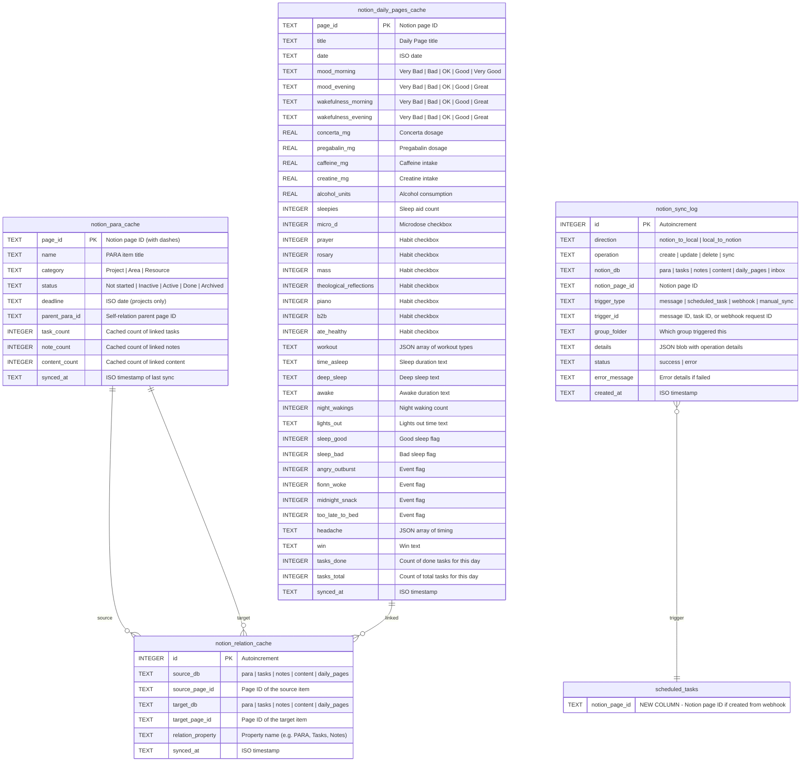

# SQLite Notion Supplementation Layer

## Overview

Add a SQLite supplementation layer that caches Notion data locally, tracks bidirectional traceability between systems, and enables SQL-powered analytics. Notion remains source of truth; SQLite is a read cache, audit trail, and analytics engine.

Three capabilities: (1) Cache & Speed Layer, (2) Bidirectional Traceability, (3) Local Analytics Engine.

## Problem Statement / Motivation

Every Notion API call is 200-500ms and rate-limited to 3 req/s. The Deep Research capability needs 15-20 API calls minimum per query. The weekly Analytics task fetches 30 Daily Pages individually, then the agent "computes" correlations in natural language — slow, expensive, and imprecise. There's no record of which WhatsApp messages triggered which Notion operations, making debugging impossible.

Meanwhile, the local SQLite database (`better-sqlite3`, already a dependency) handles messages, tasks, and sessions with <1ms query times. Extending it to cache Notion data is a natural fit.

**Quantified impact:**
- Deep Research: 15-20 API calls (5-10s) → 2-3 SQL queries (<10ms)
- Weekly Analytics: ~60 API calls over 15 minutes → single SQL query set (<1s)
- Traceability: zero visibility → full audit trail

## Proposed Solution

### Architecture

```
┌─────────────────────────────────────────────────┐
│                  Host Process                     │
│                                                   │
│  ┌──────────┐    ┌──────────┐    ┌────────────┐  │
│  │ WhatsApp │───→│ message  │───→│ Container  │  │
│  │ Channel  │    │ pipeline │    │ Runner     │  │
│  └──────────┘    └──────────┘    └─────┬──────┘  │
│                                        │         │
│  ┌──────────────────────────────────┐  │         │
│  │         SQLite (messages.db)      │  │         │
│  │                                    │  │         │
│  │  EXISTING:                        │  │         │
│  │  • chats, messages                │  │         │
│  │  • scheduled_tasks, task_run_logs │  │         │
│  │  • router_state, sessions         │  │         │
│  │  • registered_groups              │  │         │
│  │  • approval_requests              │  │         │
│  │                                    │  │         │
│  │  NEW (Phase 1 - Cache):           │  │         │
│  │  • notion_para_cache              │  │         │
│  │  • notion_relation_cache          │  │         │
│  │  • notion_daily_pages_cache       │  │         │
│  │                                    │  │         │
│  │  NEW (Phase 2 - Traceability):    │  │         │
│  │  • notion_sync_log                │  │         │
│  │  + notion_page_id on sched_tasks  │  │         │
│  │                                    │  │         │
│  │  NEW (Phase 3 - Analytics):       │  │         │
│  │  • (views/queries only, no tables)│  │         │
│  └──────────────────────────────────┘  │         │
│                                        │         │
│  ┌──────────────────────────────────┐  │         │
│  │       Notion Sync Service         │◄─┘         │
│  │  (new module: src/notion-sync.ts) │            │
│  │  • Periodic full sync (daily)     │            │
│  │  • Incremental sync (on write)    │            │
│  │  • Cache read API for snapshots   │            │
│  └──────────────────────────────────┘            │
└─────────────────────────────────────────────────┘

┌─────────────────────────────────────────────────┐
│              Agent Container                      │
│                                                   │
│  Agent reads cache via:                           │
│  1. sqlite3 CLI on mounted messages.db            │
│  2. IPC snapshot files (JSON) written pre-spawn   │
│                                                   │
│  Agent writes to Notion via MCP/curl as before    │
│  Host intercepts IPC → logs to notion_sync_log    │
└─────────────────────────────────────────────────┘
```

### ERD: New Tables



## Technical Approach

### Phase 1: Cache & Speed Layer

**New file: `src/notion-sync.ts`**

A sync service that runs on the host process (not inside the container). Responsibilities:
- Full sync: query all 5 Notion databases via direct API, populate/refresh cache tables
- Incremental sync: after agent container exits, parse IPC output for Notion operations and update cache
- Snapshot writer: write cache data as JSON to IPC directory before container spawn

**Sync strategy:**
- **Full sync** runs as a host-side scheduled interval (every 6 hours, configurable). Uses the same direct Notion API pattern already documented in `notion-reference.md` Section 8.
- **Write-through on agent exit:** When the container exits after processing, scan IPC messages for Notion operations. Update affected cache entries.
- **Stale data tolerance:** Cache is advisory. Agent can always fall back to live Notion API calls. `synced_at` timestamp lets the agent decide if cache is fresh enough.

**Implementation pattern (follows existing `src/db.ts` conventions):**

```typescript
// src/notion-sync.ts

import { db } from './db.js';
import { logger } from './logger.js';

const NOTION_API = 'https://api.notion.com/v1';
const NOTION_VERSION = '2022-06-28';

// Database IDs (from notion-reference.md)
const DB_IDS = {
  tasks: '202327f4955881b1a00aca5d9300f666',
  para: '202327f4955881d7bcbcf751c52783f9',
  notes: '202327f495588106a2eee5d2ebd7704c',
  content: '202327f49558819ca92ee4e6bff6ef76',
  daily_pages: '202327f4955881f3bb30cfdc96313d96',
} as const;

interface NotionQueryResult {
  results: Array<{ id: string; properties: Record<string, unknown> }>;
  has_more: boolean;
  next_cursor: string | null;
}

// Query a Notion database with pagination (350ms rate limit between calls)
async function queryNotionDb(
  dbId: string,
  filter?: object,
  startCursor?: string,
): Promise<NotionQueryResult> { /* ... */ }

// Full sync: enumerate all PARA items, relations, and recent Daily Pages
export async function fullSync(): Promise<void> { /* ... */ }

// Incremental: update specific pages after agent writes
export async function incrementalSync(pageIds: string[]): Promise<void> { /* ... */ }

// Write cache snapshot for container consumption
export function writeCacheSnapshot(ipcDir: string): void { /* ... */ }
```

**Schema additions in `src/db.ts`:**

```typescript
// In createSchema(), after existing tables:

// Notion cache tables
db.exec(`
  CREATE TABLE IF NOT EXISTS notion_para_cache (
    page_id TEXT PRIMARY KEY,
    name TEXT NOT NULL,
    category TEXT,
    status TEXT,
    deadline TEXT,
    parent_para_id TEXT,
    task_count INTEGER DEFAULT 0,
    note_count INTEGER DEFAULT 0,
    content_count INTEGER DEFAULT 0,
    synced_at TEXT NOT NULL
  );
  CREATE INDEX IF NOT EXISTS idx_para_cache_status ON notion_para_cache(status);
  CREATE INDEX IF NOT EXISTS idx_para_cache_category ON notion_para_cache(category);

  CREATE TABLE IF NOT EXISTS notion_relation_cache (
    id INTEGER PRIMARY KEY AUTOINCREMENT,
    source_db TEXT NOT NULL,
    source_page_id TEXT NOT NULL,
    target_db TEXT NOT NULL,
    target_page_id TEXT NOT NULL,
    relation_property TEXT NOT NULL,
    synced_at TEXT NOT NULL
  );
  CREATE INDEX IF NOT EXISTS idx_relation_source ON notion_relation_cache(source_db, source_page_id);
  CREATE INDEX IF NOT EXISTS idx_relation_target ON notion_relation_cache(target_db, target_page_id);

  CREATE TABLE IF NOT EXISTS notion_daily_pages_cache (
    page_id TEXT PRIMARY KEY,
    title TEXT,
    date TEXT NOT NULL,
    mood_morning TEXT,
    mood_evening TEXT,
    wakefulness_morning TEXT,
    wakefulness_evening TEXT,
    concerta_mg REAL,
    pregabalin_mg REAL,
    caffeine_mg REAL,
    creatine_mg REAL,
    alcohol_units REAL,
    sleepies INTEGER,
    micro_d INTEGER DEFAULT 0,
    prayer INTEGER DEFAULT 0,
    rosary INTEGER DEFAULT 0,
    mass INTEGER DEFAULT 0,
    theological_reflections INTEGER DEFAULT 0,
    piano INTEGER DEFAULT 0,
    b2b INTEGER DEFAULT 0,
    ate_healthy INTEGER DEFAULT 0,
    workout TEXT,
    time_asleep TEXT,
    deep_sleep TEXT,
    awake TEXT,
    night_wakings INTEGER,
    lights_out TEXT,
    sleep_good INTEGER DEFAULT 0,
    sleep_bad INTEGER DEFAULT 0,
    angry_outburst INTEGER DEFAULT 0,
    fionn_woke INTEGER DEFAULT 0,
    midnight_snack INTEGER DEFAULT 0,
    too_late_to_bed INTEGER DEFAULT 0,
    headache TEXT,
    win TEXT,
    tasks_done INTEGER DEFAULT 0,
    tasks_total INTEGER DEFAULT 0,
    synced_at TEXT NOT NULL
  );
  CREATE INDEX IF NOT EXISTS idx_daily_pages_date ON notion_daily_pages_cache(date);
`);
```

**Container access pattern:**

Before spawning a container, extend the existing `writeTasksSnapshot()` pattern in `src/container-runner.ts`:

```typescript
// Write PARA cache as JSON for the agent to read
import { writeCacheSnapshot } from './notion-sync.js';

// In runContainerAgent(), before spawn:
writeCacheSnapshot(ipcDir);
// Writes: /workspace/ipc/para_cache.json, /workspace/ipc/daily_pages_cache.json
```

The agent can also query SQLite directly (main group has project mounted):
```bash
sqlite3 /workspace/project/store/messages.db \
  "SELECT name, category, status, task_count, note_count FROM notion_para_cache WHERE status='Active'"
```

**CLAUDE.md update for Raiden:**

Add to the Deep Research section:
```
Before querying Notion API, check local cache:
sqlite3 /workspace/project/store/messages.db "SELECT * FROM notion_para_cache WHERE status='Active'"
If synced_at is within 6 hours, use cached data. Otherwise, query Notion API directly.
```

### Phase 2: Bidirectional Traceability

**New column on `scheduled_tasks`:**

```typescript
// Migration in createSchema():
try {
  db.exec(`ALTER TABLE scheduled_tasks ADD COLUMN notion_page_id TEXT`);
} catch { /* column already exists */ }

// Index for lookups:
db.exec(`CREATE INDEX IF NOT EXISTS idx_tasks_notion_page ON scheduled_tasks(notion_page_id)`);
```

**Update webhook handler** (`src/webhook-server.ts`):

```typescript
// When creating a task from Notion webhook, store the page ID:
const taskId = `webhook-${Date.now()}-${randomId}`;
createTask({
  id: taskId,
  prompt: `Process inbox item: "${itemName}"...`,
  notion_page_id: notionPageId,  // NEW
  // ...
});
```

**New table: `notion_sync_log`:**

```typescript
db.exec(`
  CREATE TABLE IF NOT EXISTS notion_sync_log (
    id INTEGER PRIMARY KEY AUTOINCREMENT,
    direction TEXT NOT NULL,
    operation TEXT NOT NULL,
    notion_db TEXT NOT NULL,
    notion_page_id TEXT,
    trigger_type TEXT NOT NULL,
    trigger_id TEXT,
    group_folder TEXT,
    details TEXT,
    status TEXT NOT NULL DEFAULT 'success',
    error_message TEXT,
    created_at TEXT NOT NULL DEFAULT (datetime('now'))
  );
  CREATE INDEX IF NOT EXISTS idx_sync_log_page ON notion_sync_log(notion_page_id);
  CREATE INDEX IF NOT EXISTS idx_sync_log_trigger ON notion_sync_log(trigger_type, trigger_id);
  CREATE INDEX IF NOT EXISTS idx_sync_log_created ON notion_sync_log(created_at);
`);
```

**Logging Notion operations from IPC:**

In `src/ipc.ts`, when processing agent IPC messages, intercept Notion-related operations and log them:

```typescript
// In processMessageIpc(), after sending the message:
if (ipcMessage.type === 'message' && ipcMessage.notionOperation) {
  logNotionSync({
    direction: 'local_to_notion',
    operation: ipcMessage.notionOperation.type,
    notion_db: ipcMessage.notionOperation.db,
    notion_page_id: ipcMessage.notionOperation.pageId,
    trigger_type: 'message',
    trigger_id: currentMessageId,
    group_folder: ipcMessage.groupFolder,
    details: JSON.stringify(ipcMessage.notionOperation),
  });
}
```

**Alternative (simpler) approach:** Since the agent communicates Notion operations through its streamed output text (not structured IPC), parse the output for Notion page URLs and log those. Less precise but zero changes to the agent-side IPC protocol.

### Phase 3: Local Analytics Engine

No new tables — this phase adds query functions and updates the agent's CLAUDE.md to use SQL instead of API calls.

**New file: `src/analytics-queries.ts`**

Pre-built SQL queries that the sync service can run and write as reports:

```typescript
// Habit correlation: which habits correlate with higher mood?
export function habitMoodCorrelation(days: number = 30): HabitCorrelation[] {
  return db.prepare(`
    SELECT
      'Prayer' as habit,
      AVG(CASE WHEN prayer = 1 THEN
        CASE mood_evening
          WHEN 'Very Bad' THEN 1 WHEN 'Bad' THEN 2
          WHEN 'OK' THEN 3 WHEN 'Good' THEN 4 WHEN 'Great' THEN 5
        END
      END) as avg_mood_with,
      AVG(CASE WHEN prayer = 0 THEN
        CASE mood_evening
          WHEN 'Very Bad' THEN 1 WHEN 'Bad' THEN 2
          WHEN 'OK' THEN 3 WHEN 'Good' THEN 4 WHEN 'Great' THEN 5
        END
      END) as avg_mood_without,
      SUM(prayer) as days_done,
      COUNT(*) - SUM(prayer) as days_missed
    FROM notion_daily_pages_cache
    WHERE date >= date('now', '-' || ? || ' days')
    UNION ALL
    -- Repeat for each habit...
  `).all(days) as HabitCorrelation[];
}

// Task completion rate
export function taskCompletionRate(days: number = 30): { rate: number; done: number; total: number } {
  return db.prepare(`
    SELECT
      ROUND(100.0 * SUM(tasks_done) / NULLIF(SUM(tasks_total), 0), 1) as rate,
      SUM(tasks_done) as done,
      SUM(tasks_total) as total
    FROM notion_daily_pages_cache
    WHERE date >= date('now', '-' || ? || ' days')
  `).get(days) as { rate: number; done: number; total: number };
}

// Knowledge gaps: Active PARA items with zero linked items
export function knowledgeGaps(): ParaGap[] {
  return db.prepare(`
    SELECT page_id, name, category, status, task_count, note_count, content_count
    FROM notion_para_cache
    WHERE status = 'Active'
      AND (task_count = 0 OR note_count = 0 OR content_count = 0)
    ORDER BY
      CASE WHEN note_count = 0 AND content_count = 0 THEN 0 ELSE 1 END,
      name
  `).all() as ParaGap[];
}

// Message-to-action conversion rate
export function messageActionRate(days: number = 7): { messages: number; actions: number; rate: number } {
  return db.prepare(`
    SELECT
      (SELECT COUNT(*) FROM messages
       WHERE timestamp >= datetime('now', '-' || ? || ' days')
         AND is_from_me = 0) as messages,
      (SELECT COUNT(*) FROM notion_sync_log
       WHERE created_at >= datetime('now', '-' || ? || ' days')
         AND direction = 'local_to_notion'
         AND operation = 'create') as actions
  `).get(days, days) as { messages: number; actions: number; rate: number };
}

// Task execution health
export function taskExecutionHealth(days: number = 7): TaskHealth {
  return db.prepare(`
    SELECT
      COUNT(*) as total_runs,
      SUM(CASE WHEN status = 'success' THEN 1 ELSE 0 END) as successes,
      SUM(CASE WHEN status = 'error' THEN 1 ELSE 0 END) as errors,
      ROUND(AVG(duration_ms)) as avg_duration_ms,
      MAX(duration_ms) as max_duration_ms
    FROM task_run_logs
    WHERE run_at >= datetime('now', '-' || ? || ' days')
  `).get(days) as TaskHealth;
}
```

**Analytics snapshot for agent:**

Extend `writeCacheSnapshot()` to include pre-computed analytics:

```typescript
// Write analytics summary JSON for the agent
const analytics = {
  habitCorrelation: habitMoodCorrelation(30),
  taskCompletion: taskCompletionRate(30),
  knowledgeGaps: knowledgeGaps(),
  messageActionRate: messageActionRate(7),
  taskHealth: taskExecutionHealth(7),
  generatedAt: new Date().toISOString(),
};
writeAtomicJson(path.join(ipcDir, 'analytics_cache.json'), analytics);
```

**CLAUDE.md update for Analytics task:**

Replace the current "Query last 30 Daily Pages via direct Notion API" with:
```
Read pre-computed analytics from /workspace/ipc/analytics_cache.json or query SQLite directly:
sqlite3 /workspace/project/store/messages.db < /workspace/ipc/analytics_queries.sql
The cache contains habit correlations, task completion rates, knowledge gaps, and execution health.
Focus your analysis on interpreting the data and generating actionable insights, not on data collection.
```

## Implementation Phases

### Phase 0: WAL Mode & Cross-Boundary Validation (Prerequisite)

| Step | File | Change | Tests |
|------|------|--------|-------|
| 0.1 | `src/db.ts` | Add `db.pragma('journal_mode = WAL')` after database open | `db.test.ts` |
| 0.2 | Manual test | Validate WAL works across Apple Container mount: host writes, container `sqlite3 -cmd ".timeout 5000"` reads simultaneously | Manual |
| 0.3 | Decision | If WAL works: proceed with direct SQLite access from container. If not: use IPC JSON snapshots only. | — |

### Phase 1: Cache & Speed Layer

| Step | File | Change | Tests |
|------|------|--------|-------|
| 1.1 | `src/db.ts` | Add 3 cache tables to `createSchema()` + CRUD functions + `sync_status` in `router_state` | `db.test.ts` |
| 1.2 | `src/notion-sync.ts` | New module: Notion API client, full sync (transactional), incremental sync | `notion-sync.test.ts` |
| 1.3 | `src/container-runner.ts` | Call `writeCacheSnapshot()` before container spawn | Existing tests |
| 1.4 | `src/index.ts` | Start sync interval (6h) on startup, skip if container active | Integration test |
| 1.5 | `groups/main/CLAUDE.md` | Update Deep Research + Analytics to prefer local cache | Manual verification |

**Acceptance criteria:**
- [x] `notion_para_cache` populated with all 50 PARA items after sync
- [x] `notion_relation_cache` contains PARA→Tasks/Notes/Content links
- [x] `notion_daily_pages_cache` contains last 30 Daily Pages with all properties
- [x] Cache JSON snapshot written to IPC before every container spawn
- [x] Sync completes within 2 minutes (respecting 350ms rate limit)
- [ ] Agent can query cache via `sqlite3` CLI and get results in <10ms *(needs WAL cross-boundary validation)*

### Phase 2: Bidirectional Traceability

| Step | File | Change | Tests |
|------|------|--------|-------|
| 2.1 | `src/db.ts` | Add `notion_sync_log` table + `notion_page_id` column on `scheduled_tasks` | `db.test.ts` |
| 2.2 | `src/webhook-server.ts` | Store `notion_page_id` when creating tasks from webhooks | `webhook.test.ts` |
| 2.3 | `src/ipc.ts` | Log Notion operations from agent output to `notion_sync_log` | `ipc.test.ts` |
| 2.4 | `src/notion-sync.ts` | Log sync operations (full sync, incremental) to `notion_sync_log` | `notion-sync.test.ts` |

**Acceptance criteria:**
- [x] Webhook-created tasks have `notion_page_id` set
- [ ] Every Notion create/update from the agent is logged in `notion_sync_log` *(Phase 2.3 IPC output parsing deferred)*
- [x] Sync operations (full, incremental) are logged
- [x] Can query: "What Notion operations were triggered by message X?"
- [x] Can query: "Which scheduled task corresponds to Notion page Y?"

### Phase 3: Local Analytics Engine

| Step | File | Change | Tests |
|------|------|--------|-------|
| 3.1 | `src/analytics-queries.ts` | New module: SQL query functions for all analytics | `analytics-queries.test.ts` |
| 3.2 | `src/notion-sync.ts` | Write `analytics_cache.json` in snapshot | Existing sync tests |
| 3.3 | `groups/main/CLAUDE.md` | Update Analytics + Monthly Review to use SQL cache | Manual verification |

**Acceptance criteria:**
- [x] Habit-mood correlation computed in <100ms for 30 days
- [x] Task completion rate computed in <10ms
- [x] Knowledge gap analysis (PARA items with zero links) in <10ms
- [x] Message→action conversion rate computed from `messages` + `notion_sync_log`
- [x] Task execution health computed from existing `task_run_logs`
- [x] Analytics cache JSON written and consumed by agent

## Alternative Approaches Considered

### 1. Notion API Cache in the Container (Rejected)
Cache Notion responses inside the container filesystem. Rejected because: containers are ephemeral (30-min timeout), cache wouldn't persist, and each new container would cold-start with zero cache.

### 2. Redis/External Cache (Rejected)
Adds operational complexity (another process to manage). SQLite is already embedded and handles the scale (50 PARA items, 30 Daily Pages). Redis would be overengineering.

### 3. Full Notion Mirror with Real-Time Sync (Rejected)
Mirror every Notion page body, not just properties. Rejected because: page bodies change frequently, sync would be expensive (hundreds of API calls), and the agent can still fetch individual page bodies via MCP when needed. Cache only what's needed for queries.

## Dependencies & Risks

### Critical Risks (from SpecFlow Analysis)

| Risk | Impact | Mitigation |
|------|--------|------------|
| **SQLite locking: `better-sqlite3` holds exclusive locks during writes** | Container `sqlite3` CLI reads get `SQLITE_BUSY` during sync writes (60s+ of active writes for full sync) | **Must enable WAL mode** on database open: `db.pragma('journal_mode = WAL')`. Also set `busy_timeout` on both host and container CLI: `sqlite3 -cmd ".timeout 5000"`. Batch sync writes in transactions of 50 rows max to minimize lock duration. |
| **Cross-process WAL across Apple Container mount boundary** | WAL relies on shared memory (`-shm` file). macOS host ↔ Linux container may not share locking semantics correctly over bind mount. | **Must validate empirically** before Phase 1 ships. Test: host writes while container reads via `sqlite3` CLI. If WAL doesn't work cross-boundary, fallback to **IPC JSON snapshots only** (no direct SQLite from container). |
| **Partial sync state: API fails midway through 150+ calls** | Database contains mix of current and stale data. Analytics produce incorrect results. | Wrap full sync in a transaction. On any error: rollback entire sync, keep previous data. Add `sync_status` to `router_state` ('syncing', 'complete', 'failed'). Agent checks `sync_status` before trusting cache. |
| **Traceability: agent Notion operations are invisible to host** | Agent uses MCP tools and curl directly. Host only sees streamed text output — no structured Notion operation data in IPC. | Two options: (a) Add new IPC message type `notion_operation` that agent writes after each Notion call — requires agent-side CLAUDE.md instructions + IPC protocol extension. (b) Parse streamed output for Notion page URLs (regex) — simpler but less precise. Start with (b), upgrade to (a) if needed. |

### Standard Risks

| Risk | Impact | Mitigation |
|------|--------|------------|
| Notion API rate limits during full sync | Sync takes longer, may hit 429s | 350ms delay between calls + exponential backoff. Full sync of 5 DBs ≈ 200 calls ≈ 70s |
| Stale cache leading to wrong agent decisions | Agent acts on outdated PARA status | `synced_at` timestamp on every row. Agent checks freshness. Fallback to live API. |
| Schema drift: Notion properties added/renamed | Cache misses new data | Property mapping is explicit in sync code. Review quarterly. |
| `notion_sync_log` table growth | Unbounded growth over months | Retention policy: delete logs older than 90 days (run in sync cycle) |
| Full sync during active container | Race between sync writes and agent reads | WAL mode + sync skips if container is active for the group (check `GroupQueue.isActive()`) |

## CLAUDE.md Updates Required

After implementation, update these files to teach Raiden about the cache:

1. **`groups/main/CLAUDE.md`:**
   - Deep Research section: "Check local cache first via `sqlite3`"
   - Analytics section: "Read `analytics_cache.json` instead of querying Notion API"
   - Monthly Review: "Analytics already pre-computed — focus on interpretation"

2. **`groups/main/notion-reference.md`:**
   - Add Section 8 subsection: "Local SQLite Cache" with table schemas and example queries

## Success Metrics

| Metric | Before | After |
|--------|--------|-------|
| Deep Research API calls | 15-20 | 2-3 (cache hit) |
| Deep Research latency | 5-10s | <1s (cache hit) |
| Analytics task API calls | ~60 | 0 (all from cache) |
| Analytics task duration | 15 min | <1 min |
| Notion operation traceability | 0% | 100% |
| Message→action visibility | None | Full audit trail |

## References & Research

### Internal References
- `src/db.ts` — Existing schema, migration pattern, CRUD conventions
- `src/container-runner.ts:694-756` — Existing snapshot writer pattern (`writeTasksSnapshot`, `writeGroupsSnapshot`)
- `src/webhook-server.ts` — Notion webhook → scheduled task bridge
- `src/task-scheduler.ts` — Task execution and logging patterns
- `groups/main/notion-reference.md` — Complete Notion database schemas and API patterns
- `docs/solutions/integration-issues/notion-mcp-semantic-search-filtering-limitation.md` — Why direct API is needed for enumeration
- `docs/solutions/integration-issues/notion-mcp-https-proxy-api-access.md` — Networking checklist for Notion API access

### Key Conventions
- `better-sqlite3` (sync), not `sqlite3` (async)
- ISO-8601 TEXT for all timestamps
- `CREATE TABLE IF NOT EXISTS` + `ALTER TABLE` in try/catch for migrations
- Atomic file writes (temp + rename) for IPC
- Tests: vitest, `_initTestDatabase()` for in-memory SQLite
- ES modules with `.js` import extensions
